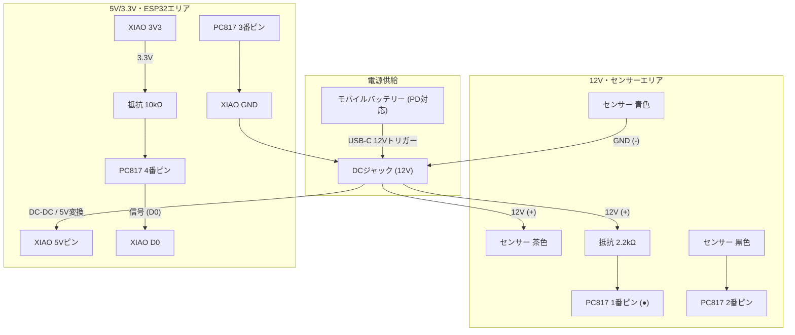

### 回路図 (Circuit Diagram)
12Vの産業用センサー(NPN出力)を、ESP_5V["XIAO 5Vピン"])で安全に受けるための絶縁回路（フォトカプラ回路）の配線図です。この回路を2セット（スタート用・ゴール用）作成します。
### 簡易配線図 


## 接続の詳細
### 左側 (12V・センサー側)
* モバイルバッテリーに「12Vトリガーケーブル」を接続し、ブレッドボードの左側ラインに12Vを供給します。
* センサー: OMRON E3Z-R66 (NPN出力)
  * 茶色: +12V (赤ライン) に直結
  * 青色: GND (青ライン) に直結
  * 黒色: フォトカプラの 2番ピン へ接続
  * 白色: 未使用 (絶縁処理)
* 抵抗: 2.2kΩ (赤・赤・赤・金)
  * 12V電源とフォトカプラ1番ピンの間に必ず入れてください。

### 右側 (5V・ESP32C6側)
注意: ESP32に直接12Vを入れると破損します。必ずDC-DCコンバータ等で5Vに落とすか、ESP32の「5V」ピンに適切な電圧（USB給電など）を供給してください。
* マイコン: ESP32C6
* 抵抗: 10kΩ (茶・黒・橙・金)
  * プルアップ抵抗として使用します。
* フォトカプラ: PC817 (または TLP785)
  * 1番ピン(●): 12V側 (2.2kΩ経由)
  * 2番ピン: センサー黒色
  * 3番ピン: ESP_GND
  * 4番ピン: ESP_D0["XIAO D0"](ここから信号を取り出す)
### ブレッドボード実体配線イメージ
フォトカプラを中央の溝にまたがせて配置します。

```   
【 左側エリア：12V・センサー 】            |               【 右側エリア：ESP_3V3"XIAO 3V3" 】
                                        |
[12V バッテリー (+)] ━(赤ライン)━━━━━━━━━|━━━━━━━━━━━━━━━━━━━(赤ライン)━ [ESP_3V3"XIAO 3V3"]
      ┃                                 |                       ┃
      ┣━━━[センサー茶色]                 |                       ┣━━[10kΩ 抵抗]
      ┃                                 |                       ┃
      ┣━━━[2.2kΩ 抵抗]━━━━━━━━━━┓ (1番)  |     (4番) ┏━━━━━━━━━━━┻━━ [ESP_D0 "XIAO D0"]
      ┃                           ↓      |      ↓  
      ┃                           [ P C 8 1 7 ]     
      ┃                           ↓      |      ↓  
      ┃       [センサー黒色] ━━━━┛ (2番)  |    (3番) ┗━━━━━━━━━━━━━━┓
      ┃                                  |                         ┃
      ┣━━━[センサー青色]                  |                         ┃
      ┃                                  |                         ┃
[12V バッテリー (-)] ━(青ライン)━━━━━━━━━━━|━━━━━━━━━━━━━━━━━━━━━━(青ライン)━ [ESP_GND]
```
