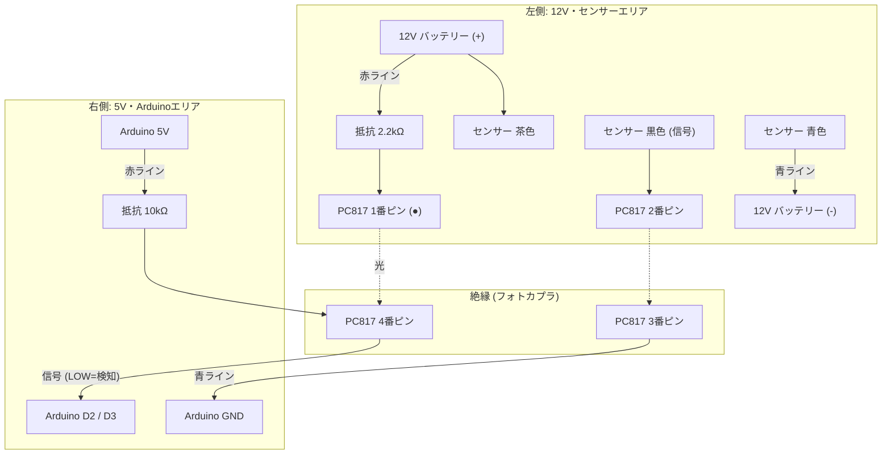

### 回路図 (Circuit Diagram)
12Vの産業用センサー(NPN出力)を、Arduino(5V)で安全に受けるための絶縁回路（フォトカプラ回路）の配線図です。この回路を2セット（スタート用・ゴール用）作成します。
### 簡易配線図 


## 接続の詳細
### 左側 (12V・センサー側)
Arduinoとは電気的に接続しません（絶縁）。
* 電源: 12Vバッテリー (またはACアダプター)
* センサー: OMRON E3Z-R66 (NPN出力)
  * 茶色: +12V (赤ライン) に直結
  * 青色: GND (青ライン) に直結
  * 黒色: フォトカプラの 2番ピン へ接続
  * 白色: 未使用 (絶縁処理)
* 抵抗: 2.2kΩ (赤・赤・赤・金)
  * 12V電源とフォトカプラ1番ピンの間に必ず入れてください。

### 右側 (5V・Arduino側)
Arduinoの電源を使って信号を読み取ります。
* マイコン: Arduino Nano R4 (または Uno R3)
* 抵抗: 10kΩ (茶・黒・橙・金)
  * プルアップ抵抗として使用します。
* フォトカプラ: PC817 (または TLP785)
  * 1番ピン(●): 12V側 (2.2kΩ経由)
  * 2番ピン: センサー黒色
  * 3番ピン: Arduino GND
  * 4番ピン: Arduino D2/D3 (ここから信号を取り出す)
### ブレッドボード実体配線イメージ
フォトカプラを中央の溝にまたがせて配置します。

```   
【 左側エリア：12V・センサー 】            |               【 右側エリア：Arduino・5V 】
                                        |
[12V バッテリー (+)] ━(赤ライン)━━━━━━━━━|━━━━━━━━━━━━━━━━━━━(赤ライン)━ [Arduino 5V]
      ┃                                 |                       ┃
      ┣━━━[センサー茶色]                 |                       ┣━━[10kΩ 抵抗]
      ┃                                 |                       ┃
      ┣━━━[2.2kΩ 抵抗]━━━━━━━━━━┓ (1番)  |     (4番) ┏━━━━━━━━━━━┻━━ [Arduino D2/D3]
      ┃                           ↓      |      ↓  
      ┃                           [ P C 8 1 7 ]     
      ┃                           ↓      |      ↓  
      ┃       [センサー黒色] ━━━━┛ (2番)  |    (3番) ┗━━━━━━━━━━━━━━┓
      ┃                                  |                         ┃
      ┣━━━[センサー青色]                  |                         ┃
      ┃                                  |                         ┃
[12V バッテリー (-)] ━(青ライン)━━━━━━━━━━━|━━━━━━━━━━━━━━━━━━━━━━(青ライン)━ [Arduino GND]
```
