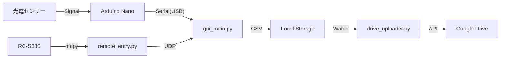

# Moto Gymkhana Timing System (MGTS)


モトジムカーナ（バイク競技）のための、**NFCエントリー機能付き自動タイム計測システム** です。
産業用光電センサーによる高精度な計測と、NFCタグによるスムーズなライダー登録を実現します。

## 🚀 特徴

* **自動計測:** Arduinoと光電センサーによる0.01秒単位の正確な計測。
* **NFCエントリー:** ICカードをかざすだけでライダー名とIDを登録（順番待ちリストへ追加）。
* **シグナルスタート:** 赤→黄→緑のシグナル表示、フライング検知、リアクションタイム計測機能。
* **追走対応:** コース上に複数台が走行していても正しく計測・管理可能。
* **クラウド連携:** 計測結果（CSV）をGoogle Driveへ自動アップロードし、スマホでリアルタイムにリザルト確認。
* **高可用性:** 計測アプリ(GUI)とNFCリーダーを別プロセス化し、USB切断などでリーダーが落ちても計測を止めない堅牢な設計。

## 🛠️ システム構成

### ハードウェア
* **PC:** WindowsノートPC (メイン処理、GUI表示)
* **マイコン:** Arduino Nano R4 Minima (センサー信号処理)
* **センサー:** OMRON E3Z-R66 (回帰反射型光電センサー) × 2 (Start/Stop)
* **NFCリーダー:** Sony RC-S380 (PaSoRi)
* **回路:** フォトカプラ (PC817) による12V/5V絶縁回路

### ソフトウェア構成



### 📦 インストール
## 必要要件
* Python 3.10以上
* Arduino IDE (初回書き込み用)

## セットアップ手順
1.リポジトリのクローン
```
Bash

git clone https://github.com/uspat1234-bit/moto-gymkhana-timer.git
cd moto-gymkhana-timer
```
2.ライブラリのインストール
```
Bash

pip install -r requirements.txt
# または
pip install tk nfcpy pyserial google-api-python-client google-auth-oauthlib pygame

```
3.NFCドライバーの設定 (Windowsのみ)


* Zadig を使用して、RC-S380のドライバーを WinUSB に変更してください。

4.Arduinoの準備


* Arduino IDEで arduino_sketch/sensor_firmware.ino を開き、Arduino Nano R4に書き込みます。

5.Google Drive設定 (オプション)

* Google Cloud ConsoleでAPIを有効化し、client_secret.json をルートディレクトリに配置してください。

## NFCタグの作成 (Writer Tool)
* 参加者配布用のタグを作成するためのツールです。
```
Bash

python writer.py
```

1. ライダー名、ID、車両名を入力します。

2. 「書き込み待機中...」と表示されたら、リーダーにタグをセットします。

3. 自動的にメモリクリアと書き込みが行われます。

## 🚦 使い方
* ランチャー (launcher.py) を起動すると、全ての機能にアクセスできます。
```
Bash

python launcher.py
```
1. 通常モード (Normal Mode)

* 光電センサーによるシンプルなタイム計測。


* 好きなタイミングでスタートできます。


* 複数台のコースイン（追走）に対応。

2. シグナルモード (Signal Mode)

* 画面上のシグナル（🔴→🟡→🟢）に合わせてスタート。


* フライング検知: 緑点灯前にスタートすると FALSE START と表示（計測は続行）。


* リアクションタイム: 緑点灯からスタートまでの反応速度を表示。


* 2回タッチスタート: 1回目のNFCタッチでエントリー、2回目でシグナル開始。

3. NFCエントリー

* remote_entry.py がバックグラウンドで起動します。


* NFCタグ（Suica、免許証、専用タグ）をリーダーにかざすと、ライダー名が登録され「待ち行列（Queue）」に追加されます。

### 📂 ディレクトリ構造
```
Plaintext
.
├── launcher.py          # 統合ランチャー
├── gui_main.py          # 通常モードGUI
├── gui_signal.py        # シグナルモードGUI
├── remote_entry.py      # NFC読み取り & UDP送信
├── drive_uploader.py    # Google Drive自動アップロード
├── timing_core.py       # 計測ロジック (Core)
├── timing_signal.py     # 計測ロジック (Signal拡張)
├── gpio_sensor.py       # センサー入力処理 (Serial通信)
├── arduino_sketch/      # Arduino用コード
│   └── sensor_firmware.ino
└── gymkhana_data/       # 計測ログ (CSV) 保存先
```

🤝 Contributing
バグ報告や機能追加のプルリクエストは大歓迎です！
