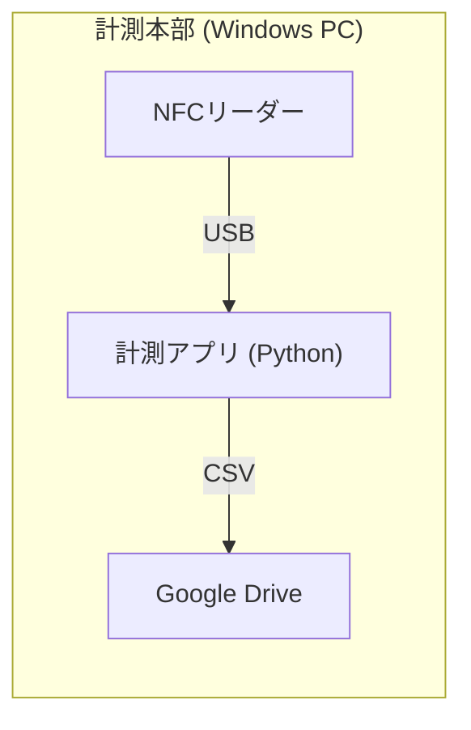
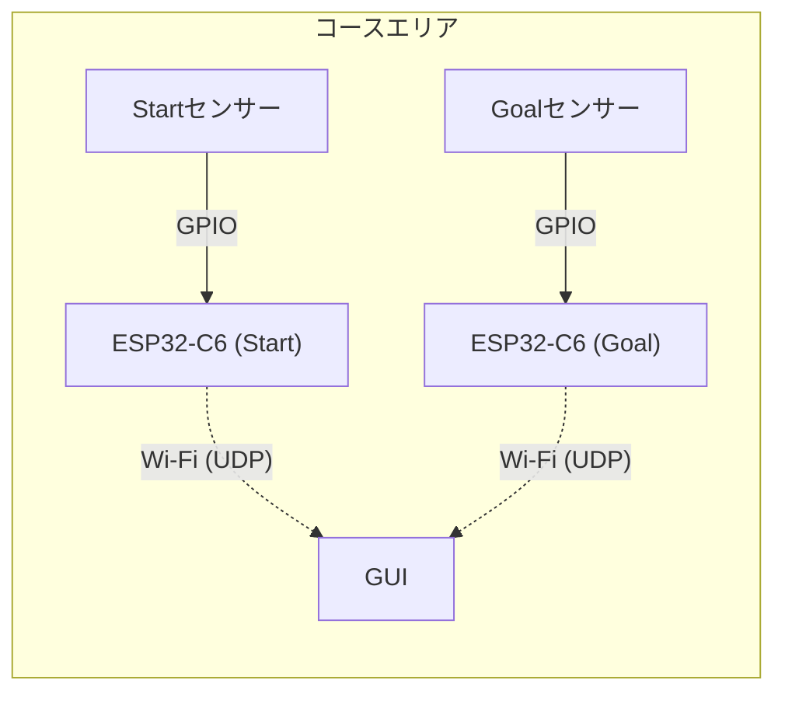

# Moto Gymkhana Timing System (MGTS)


モトジムカーナ（バイク競技）のための、Wi-Fi 6対応 完全ワイヤレス自動タイム計測システム です。
高圧線下などのノイズ環境でも安定して通信できるESP32-C6を採用し、PCとセンサー間を無線化。配線の煩わしさから解放されます。

## 🚀 特徴

* **自動計測:** ESP32-C6と光電センサーによる0.01秒単位の正確な計測。
* **NFCエントリー:** ICカードをかざすだけでライダー名とIDを登録（順番待ちリストへ追加）。
* **シグナルスタート:** 赤→黄→緑のシグナル表示、フライング検知、リアクションタイム計測機能。
* **追走対応:** コース上に複数台が走行していても正しく計測・管理可能。
* **クラウド連携:** 計測結果（CSV）をGoogle Driveへ自動アップロードし、スマホでリアルタイムにリザルト確認。
* **高可用性:** 計測アプリ(GUI)とNFCリーダーを別プロセス化し、USB切断などでリーダーが落ちても計測を止めない堅牢な設計。

## 🛠️ システム構成

### ハードウェア
* **PC:** WindowsノートPC (メイン処理、GUI表示)
* **マイコン:** ESP32-C6(センサー信号処理)
* **センサー:** OMRON E3Z-R66 (回帰反射型光電センサー) × 2 (Start/Stop)
* **NFCリーダー:** Sony RC-S380 (PaSoRi)
* **回路:** フォトカプラ (PC817) による12V/5V絶縁回路

### ソフトウェア構成




## 📦 ダウンロードと使い方 (Windows用)

Pythonのインストールや難しい設定は不要です。

1. ダウンロード

GitHubの [Releases](https://github.com/uspat1234-bit/moto-gymkhana-timer/releases) ページから、最新の GymkhanaSystem_vX.X.zip をダウンロードしてください。
ZIPファイルを解凍し、好きな場所（デスクトップなど）にフォルダを置きます。

2. Google Driveの設定 (初回のみ)

まず、Google Drive連携に必要な準備を行います。同梱の SETUP_GDRIVE.md を参照して、Google Cloudの設定と認証ファイルの配置を行ってください。

その後、フォルダ内の Config.bat をダブルクリックして設定ファイルを開きます。
アップロード先のGoogle DriveフォルダIDを入力して保存します。
```
[GoogleDrive]
# Google DriveのフォルダURLの末尾にあるIDを記入してください
# 例: [https://drive.google.com/drive/folders/XXXXXXXXXXXX](https://drive.google.com/drive/folders/XXXXXXXXXXXX)
FolderID = XXXXXXXXXXXX
```

※初回起動時にブラウザが開き、Googleアカウントへのログインを求められる場合があります。  

3. PCのWi-Fi設定
ノートPCの「モバイルホットスポット」をONにします。

SSID: motogym

PASS: password123

帯域: 2.4GHz
※ESP32はこのSSIDに自動接続するようにプログラムされています。


4. アプリの起動

フォルダ内の Launcher.bat をダブルクリックします。
ランチャーが起動し、以下の機能が選べます。

通常モード (Normal Mode): シンプルなタイム計測。

シグナルモード (Signal Mode): 本格的なシグナルスタート計測。

NFCタグ作成 (Writer): 参加者配布用のNFCタグを作成。


### 開発者向け
### 📦 インストール
## 必要要件
* Python 3.10以上
* Arduino IDE (初回書き込み用)

## セットアップ手順
1.リポジトリのクローン
```
Bash

git clone https://github.com/uspat1234-bit/moto-gymkhana-timer.git
cd moto-gymkhana-timer
```
2.ライブラリのインストール
```
Bash

pip install -r requirements.txt
# または
pip install tk nfcpy pyserial google-api-python-client google-auth-oauthlib pygame

```
3.NFCドライバーの設定 (Windowsのみ)


* Zadig を使用して、RC-S380のドライバーを WinUSB に変更してください。

4.ESP32-C6への書き込み


* Arduino IDEで arduino_sketch/sensor_wifi_udp_start.ino,sensor_wifi_udp_stop.ino を開き、ECS32-C6に書き込みます。

5.Google Drive設定 (オプション)

* Google Cloud ConsoleでAPIを有効化し、client_secret.json をルートディレクトリに配置してください。

## NFCタグの作成 (Writer Tool)
* 参加者配布用のタグを作成するためのツールです。
```
Bash

python writer.py
```

1. ライダー名、ID、車両名を入力します。

2. 「書き込み待機中...」と表示されたら、リーダーにタグをセットします。

3. 自動的にメモリクリアと書き込みが行われます。

## 🚦 使い方
* ランチャー (launcher.py) を起動すると、全ての機能にアクセスできます。
```
Bash

python launcher.py
```
1. 通常モード (Normal Mode)

* 光電センサーによるシンプルなタイム計測。


* 好きなタイミングでスタートできます。


* 複数台のコースイン（追走）に対応。

2. シグナルモード (Signal Mode)

* 画面上のシグナル（🔴→🟡→🟢）に合わせてスタート。


* フライング検知: 緑点灯前にスタートすると FALSE START と表示（計測は続行）。


* リアクションタイム: 緑点灯からスタートまでの反応速度を表示。


* 2回タッチスタート: 1回目のNFCタッチでエントリー、2回目でシグナル開始。

3. NFCエントリー

* remote_entry.py がバックグラウンドで起動します。


* NFCタグ（専用タグ）をリーダーにかざすと、ライダー名が登録され「待ち行列（Queue）」に追加されます。

### 📂 ディレクトリ構造
```
Plaintext
.
├── launcher.py          # 統合ランチャー
├── gui_main.py          # 通常モードGUI
├── gui_signal.py        # シグナルモードGUI
├── remote_entry.py      # NFC読み取り & UDP送信
├── drive_uploader.py    # Google Drive自動アップロード
├── timing_core.py       # 計測ロジック (Core)
├── timing_signal.py     # 計測ロジック (Signal拡張)
├── gpio_sensor.py       # センサー入力処理 (Serial通信)
├── arduino_sketch/      # Arduino用コード
│   └── sensor_firmware.ino
└── gymkhana_data/       # 計測ログ (CSV) 保存先
```

🤝 Contributing
バグ報告や機能追加のプルリクエストは大歓迎です！
